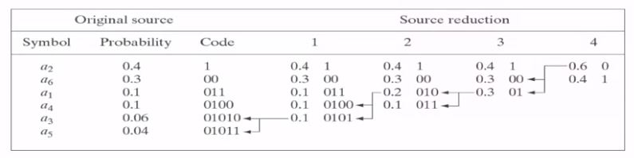

# Week_2

## Image and video compression - JPEG

In week 2, we are going to learn image compression by JPEG, which is probably the most important algorithm in this field. Its procedure is attatched below.

 (Picture 0) 

## Construct n x n subimages
In this stage, we are going to cut the image into several blocks, and each one of these blocks has n x n pixels. You can chose what's the value of N, but basically jpeg uses 8 x 8 block. It's easy for a greyscale image because you only have one channel, but for colour image, which has 3 channels of RGB, we just do the same thing to each of them. 

But normally, there are a lot of coorelation between the channels, so jpeg, instead of calling RGB, goes to another dimention called Y, Cb, CR. It is an easy transform, and you can easily get information on the internet but here we just focus on jpeg. Now we've got an image in Y, Cb, CR domain, and the next step will be doing a Forward transform called Discrete Cosine Transform(DCT).

 

## Forward transform
Before DCT, let's talk about why we need to do a forward transform, and introduce Karhunen-Loeve transform(KLT). 

First of all, let us explain how do we measure the error that we create in images when we're doing a lossy compression. The basic idea is that the way we measure error is called mean squared error(MSE). The formula is attatched below.

Now, why are we going to do a transform ? Our ultimate goal in this stage is to compress the image as much as we could and send it out. By doing so, we try to transmit just only one pixel to represent a 8x8 block. Obviously, we should get a tremendous  error in MSE by sending only one pixel. But, we might be able to transform the original 8x8 block into a different 8x8 block in different domain which should be reversable to achieve this goal, and this is the reason why we are doing a forward transform.

There is a transform that allow us to take only the first pixel and still could get the smallest MSE called the Karhunen-Loeve transform(KLT). But, it has a major problem of its speed. It's very slow, and it can not allow us to do thing on the fly as the data is passing. So to solve this problem, we are going to replace the optimal one, Karhunen-Loeve transform, into the the suboptiaml one, Discrete Cosine Transform(DCT).

Why a discrete cosine transform? Why not a Fourier transform or any other transform? How the mark transform? There are many transforms out there. So there is a couple of reasons why we use the DCT. One of them is that, although I want to do a Karhunen-Loeve transform, I need to do a DCT. It turns out that the DCT is for particular cases, actually exactly equal to the Karhunen-Loeve transform. Those particular cases are when the images what's called Markovian.

 

## Quantization
why are we doing quantization? We are doing quantization because we are going to do Huffman coding after that. And remember, in Huffman coding, we want a non-uniform distribution. We want some coefficients to appear a lot, so we're going to give a short code, and some coefficients to appear not much, so we can give them a long code. for example, if we quantize a load, we might find out that 7, 8, 9, 10 all become 0. And then we're going to be able to basically compress a lot

 

## Huffman coding

This is a sort of prefix-free code which will simplify the process of reconstructuring the original signal and save the memory with a very simple conputation. 

 (Picture 1) 

 

 (Picture 2) 

For example, look at the column Code, and you might notice that there is always a digit that is different from the other digits in every column. When the decoder receives the first digit which is one, then the decoder should know that its no need to wait for another digit to identify which symbol it is. 

Otherwise, in the same context, if the first digit that decoder receives is zero, then it should wait for another digit to determine whether it should stop waiting or not. And so on, until we are able to indentify every symbol in the list.

