# Week_2 Image and video compression

## JPEG

In week 2, we are going to learn image compression by JPEG, which is probably the most important image processing algorithm overall. Its procedure is attatched below.

 

(Picture 0) 

## Construct n x n subimages
In this stage, we are going to cut the image into several blocks, and each one of these blocks has n x n pixels. You can chose what's the value of N, but basically JPEG uses 8 x 8 block. It's easy for a greyscale image because you only have one channel, but for colour image, which has 3 channels of RGB, we just do the same thing to each of them. 

But normally, there are a lot of coorelation between the channels, so JPEG, instead of calling RGB, goes to another dimention called Y, Cb, CR. It is an easy transform, and you can easily get information on the internet but here we just focus on JPEG. Now we've got an image in Y, Cb, Cr domain, and the next step will be doing a Forward transform called Discrete Cosine Transform(DCT).

 

## Forward transform
Before DCT, let's talk about why we need to do a forward transform, and introduce Karhunen-Loeve transform(KLT). 

First of all, let us explain how do we measure the error that we create in images when we're doing a lossy compression. The basic idea is that the way we measure error is called mean squared error(MSE).

Now, why are we going to do a transform ? Our goal is to compress the image as much as we could and send it out. By doing so, we try to transmit just only one pixel to represent a 8x8 block. Obviously, we should get a tremendous  error in MSE by sending only one pixel. But, we might be able to transform the original 8x8 block into a different 8x8 block in different domain which should be reversable to achieve this goal, and this is the reason why we are doing a forward transform.

There is a transform that allows us to take only the first pixel and still could get the smallest MSE called the Karhunen-Loeve transform(KLT). But, it has a major problem of its speed. It's very slow, and it can not allow us to do thing on the fly as the data is passing. So to solve this problem, we are going to replace the optimal one, Karhunen-Loeve transform, into the the suboptimal one, Discrete Cosine Transform(DCT).

Why Discrete Cosine Transform? Why not Fourier Transform(FT) or any other transforms? There is a couple of reasons why we use the DCT. One of them is that, although we want to do a Karhunen-Loeve transform, we need to do a DCT. It turns out that the DCT is for particular cases, actually exactly equal to the Karhunen-Loeve transform. Those particular cases are when the images what's called Markovian. 

Another sensable reason is that FT has a underlying assumption of periodicity. It assumes that an image repeats itself, but apparently it's not gonna happen in each image or even in our nxn block. For example, look at the upper curve in the Picture 1. You may notice the discontinuity between the boundary points, which makes FT no sense in this situation.

 

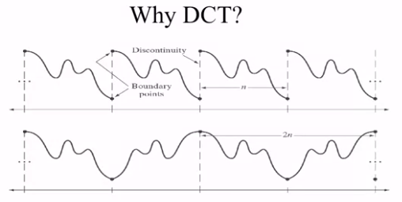

(Picture 1) 

 

How about DCT? Does it do better than FT? Let's see the formula for DCT.

We assume that we have a NxN image, and its grey value on the position (x,y) is f(x,y)
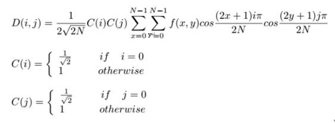

(Formula 1)

Let's start with 1D array. Now, let's just focus on first cosine function and ignore other parameters and constants. The formula of the cosine function is attached below.

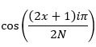

(Formula 2)

By running cosine_value.py, we can get an result of that signs and values of the outcome of the cosine function are almost symmetrical. For i = 0, the outcome always eqauls to 1, which means we will get all information without scaling or noise. For i = 1, it becomes the first 4 elements minus the last 4. Then, you may notice the sign of outcomes change faster as the increase of the value of i.

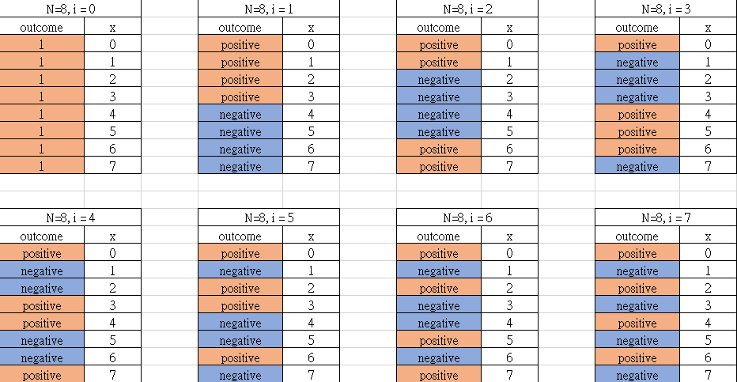

(Picture 2)

Until now we already know the underlying significance of cosine function is basically weighting and reversing some pixels in a approximately symmetrical way. Let's go back to the context of processing an image, using the equation from Formula 1 but just ignore the coefficent and the parameters related to j and y, which looks like Formula 3. 

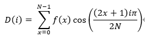

(Formula 3)

When the value of i equals to zero, we will get an original image. When the value of i comes to 1, we use the first 4 pixels minus the last 4, so if we get a great number from Formula 3 it means that the grey value within this region changes significantly, and we may can consider this region as an image with noise or edges. In contrast, if we get a low number from Formula 3, it means that this region is basically a smooth, constant part of the picture.

So, what about we get a large value from Formula 3 when the value of i is quite high? Let's pay attention on the last table in Picture 2. Signs of adjacent outcomes change superfast(or you can say the frequency is high), which means comparing with i=1, if we still get a great value from Formula 3, the possibility of getting edges or noise in this region is much higher(because most of the grey value of edges or noise change significantly even in a small region or adjacent pixels). And maybe, for my personal understanding, that's the reason why people consider high frequency region as the place that edges and noise exist.

Combining all the things above together, we can make a conclusion of that if an array in x-domain(spacial domain) is an approximately constant background, we will only get a relatively higher value in the beginning of i-domain(frequency domain) array and rest of the value in this i-domain array should be low. On the other hand, we will have a large number in i-domain if the x-domain array has a high variation, where the edges or noise may exist.

Now, we can just put all the things back to Formula 1, and its concept is exactly the same with the easier version, because most of them are constant or close to constant. Firtly, We just take the grey value from spacial domain. Secondly, use cosine function to weigh and reverse it. Finally, multiply them with some coefficents to get the result. The value situated in the upper-left corner called DC value should have a relatively higher value to the others. As the coordination move from the upper-left corner to the lower-right corner, the value in the position should be getting lower and lower, until 0. 

 

## Huffman Coding

This is a sort of prefix-free code which will simplify the process of reconstructuring the original signal and save the memory with a very simple conputation. Now, let's start with how well can Huffman Coding compresss and then we will se how do we do Huffman Coding.

 

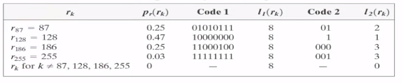

(Picture 3) 

- rk : grey value  
- pr(rk) : posibility of rk  
- Code 1 : 8 bits binary representation  
- l1(rk) : number of bits that binary representation uses
- Code 2 : binary representation after doing Huffman Coding
- l2(rk) : number of bits that Huffman Coding uses

Let's take a glance at Picture 3. You can see the power of Huffman Coding just by comparing the number between l1 and l2, which are length of the Code that the methods use. Note that the higher the probability of occurance of an symbol, the shorter the length of the symbol after doing Huffman Coing, which is quite an important property of Huffman Coding.

 

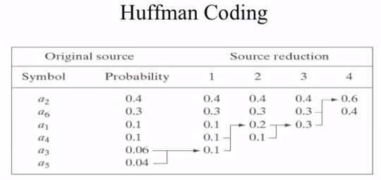

(Picture 4) 

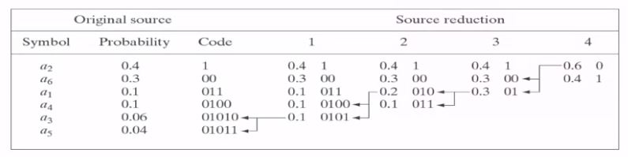

(Picture 5) 

The way doing Huffman Coding is illustrated as Picture 4 & 5, which are ordering and encoding respectively. 

Firstly, like the first two columns from the left, write down the symbol and its probability in the order of the symbol's probability. 

Secondly, combine the last two elements into one in the Probability column and rearrange the column in numerical order until there are only two numbers left. 

Thirdly, let's start from the right to the left, give a 0 to the higer number, a 1 to the lower number. 

Finally, undo the thing we just did in second step, and also give a 0 and a 1 until the number of elements in the Probability column is the same with the Symbol column's. For example, 0.6 comes from the combination of two 0.3, so we just separate 0.6 into two 0.3 and give it a 0 and a 1 just like what Picture 3 does.

Now, we get the Huffman Code like the Code column. You might notice that there always has one different character from others in a column, and that's the key when decoding Huffman Coding. For receivers, when they get the first digit which is one for the first digit in this example, then receivers should know that its no need to wait for another digit to identify which symbol it is. 

While if the first digit that decoders receives zero, then they should wait for another digit to determine whether it should stop waiting or not until it is able to indentify every symbol in the list.

 

## Quantization
So far, we already know after doing DCT we will get an matrix or an image whose grey value normally decreases from upper-left to lower-right. Then, we can do the quantization which allows us to compress a lot. Also, in this step, we try to make a non-uniform distribution so that we will have a better result from doing the Huffman Coding. Let's take 8x8 block as an exmaple, and have a look at the image below.

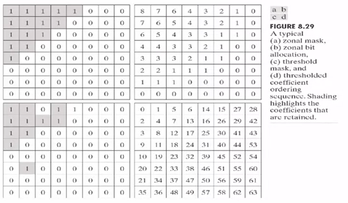

(Picture 3)

There are many ways we can do the quantization. For example, we can only take some coefficients and remove others like what picture a in Picture 3 does, or we can specify which coefficient we are going to take just like picture c in Picture 3. 
In these methods, we can specify which exactly the pixels we want to send, but the disadvantage of this method is that we still need to send 8 bits to represent a pixel.

Now, what JPEG says something very smart, for the picture b in Picture 3. For indexing, the first outcome from Formula 3, which is D0, we put it on the upper-left corner, and put the second outcome D1 right next to D0 in horizontal direction. Then we do a zigzag fashion until it reaches to the lower-right corner just like the number which is exactlly the index of outcome from Formula 3 in picture d. 

For the quantization, we are going to take some pixels and represent it with 8 bits and another with 7 bits and so on, until reaching the lower-right corner. It allows us to compress a lot but still can do a reasonable job just by quantizing the pixels that we are more interested in with 256 degrees and using only one or two numbers to represent the less important pixels.

The benefit of using these methods are that we already know the grey value will decrease as the increase in index number. So when JPEG arrives to a certain coefficient, and sees that everybody else that comes after becomes 0, it just puts one signal that says end. We can know that every following pixel should be zero, then we are able to save a lot of bits.

So that's the basic idea of quantization, before seeing how the JPEG does the quantization maybe here is a good place to take a break.

 

> During the break, you may can think a question that why we pay more interest in the upper-left instead of others during the quantization. For my personal understanding of this question is situated at the bottom of this artical, after thinking you may can have a look at it.

 

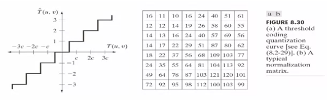
(Picture 4)

For doing the quantization, we are going to round every outcome from Formula 3 down to its closest number based on the specific coefficients cooresponding to a typical normalization matrix situated on the picture b in Picture 4. Let's take D(0,0) as an example.

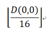

(Formula 4)

Once we have done the rounding part, the value between 0~15 will become 0, and the value between 16~31 will become 1 and so on. You may notice that the number at the upper-left corner is quite lower than the number located at the lower-right, which is also the same question you thought during the break time.

This part is crucial to Huffman Coding, because when doing Huffman Coding, we are expecting it has an non-uniform distribution so that we can compress a lot. By doing the quantization, we are basically increasing the posibility of some numbers from appearing or making it more concentrated.

After doing the quantization, the matrix is ready to encode by Huffman Coding, and send it out. 

For receivers, they will do exactlly opposite way of what we just did. Let's just take D(0,0) as an example again, and have a look at Formula 5. 

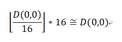

(Formula 5)

Once receivers get the signal, what receivers do is multiplying it by the specific number cooresponding to the normalization matrix, and they will get the result that is approximately the same with the original one. 
